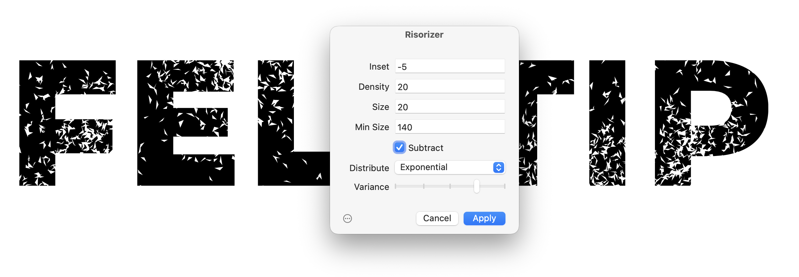

# Risorizer

Effect plug-in for the [Glyphs.app](https://www.glyphsapp.com) font editor for adding a Risograph-like effect on your shapes.

## Installation

1. One-click install *Risorizer* from *Window > Plugin Manager*
2. Restart Glyphs.

## Usage

The filter will populate your shapes with many ‘debris particles’, small triangular paths. The settings will control how:

- **Inset:** How far away from the edge of the shape you want to place debris particles.
- **Density:** How many debris particles you want to place.
- **Size:** Average size of particles.
- **Min Size:** minimum size for each debris shape in square units. Any stray particle under that size will not be used.
- **Subtract:** If activated, will subtract the debris shape from the letter shapes (recommendable if you want to chip away on the shape edges with a negative inset). If deactivated, it will reverse the path direction of the debris shapes (more efficient if you have a large inset).
- **Distribute:** different random distribution models. Experiment and pick whatever looks best for you. You may need to adjust Density for some of the models.
- **Variance:** allowed differences in size between debris particles. Lowest setting means uniform size, higher settings mean some particles are bigger than others. 

You can also add the filter as custom parameter to one of your (static) instances in *Font Info > Exports.* Use the actions menu in the lower left to copy the current settings into the clipboard, for pasting in the custom-parameter area in Font Info.

Keep in mind it is CPU-intensive, so exporting a whole font with this effect will take some time.

### License

Copyright 2020-2026 Rainer Erich Scheichelbauer (@mekkablue).
ObjectiveC version based on sample code by Georg Seifert (@schriftgestalt).

Licensed under the Apache License, Version 2.0 (the "License");
you may not use this file except in compliance with the License.
You may obtain a copy of the License at

http://www.apache.org/licenses/LICENSE-2.0

See the License file included in this repository for further details.
