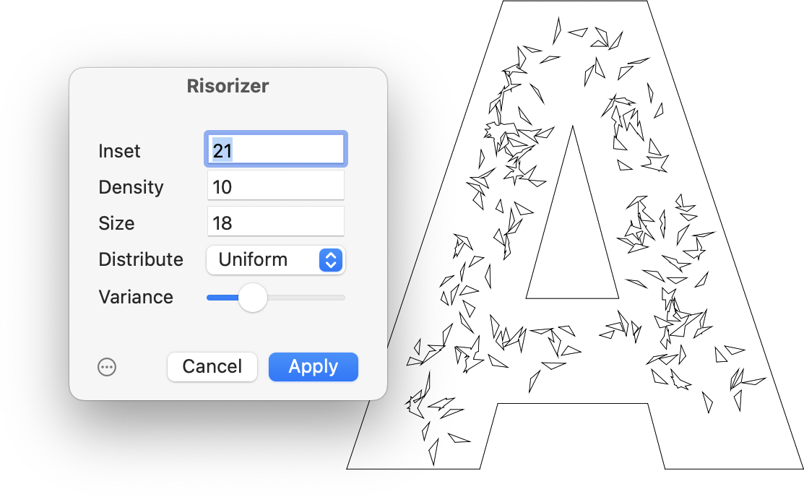

# Risorizer

Effect plug-in for the Glyphs.app font editor for adding a Risograph-like effect on your shapes.

### Installation

1. One-click install *Risorizer* from *Window > Plugin Manager*
2. Restart Glyphs.

### License

Copyright 2020 Rainer Erich Scheichelbauer (@mekkablue).
Based on sample code by Georg Seifert (@schriftgestalt) and Jan Gerner (@yanone).

Licensed under the Apache License, Version 2.0 (the "License");
you may not use this file except in compliance with the License.
You may obtain a copy of the License at

http://www.apache.org/licenses/LICENSE-2.0

See the License file included in this repository for further details.
